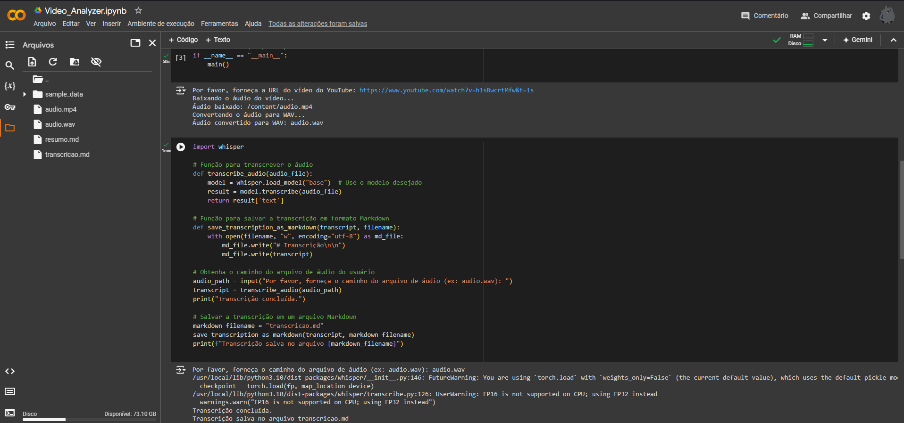

# Analisador de Vídeos do YouTube

## 📕 Descrição

Este projeto é um analisador de vídeos do YouTube que utiliza o modelo Whisper para transcrever o áudio dos vídeos e, em seguida, gerar um resumo da transcrição. É uma ferramenta útil para quem deseja extrair informações de vídeos de forma rápida e eficiente.

**🔧 Este projeto está em construção!** Funcionalidades e melhorias estão sendo implementadas.

> [!TIP]
> **Você pode acessar o projeto no:** 
> .
> 

## ⚙️ Funcionalidades

- **Transcrição de Áudio**: Converte o áudio dos vídeos do YouTube em texto utilizando o Whisper.
- **Geração de Resumo**: Cria um resumo conciso a partir da transcrição do vídeo.
- **Suporte a Vários Idiomas**: Funciona com vídeos em diferentes idiomas, dependendo do suporte do Whisper.

## 🛠️ Como Funciona o Script

O analisador de vídeos do YouTube opera em duas etapas principais:

1. **Transcrição**:
   - O script faz o download do vídeo do YouTube e extrai o áudio.
   - Utiliza o modelo Whisper para transcrever o áudio em texto, resultando em uma transcrição completa do vídeo.

2. **Geração de Resumo**:
   - A partir da transcrição, o script analisa o texto e gera um resumo, destacando os principais pontos abordados no vídeo.

Esse fluxo de trabalho permite que usuários extraiam informações valiosas de vídeos longos de forma rápida e prática.

## 💻 Pré-requisitos

Certifique-se de ter o Python instalado. Você pode instalar as dependências usando o arquivo `requirements.txt`.

### 📦 Instalação de Dependências

1. Clone o repositório para o seu ambiente local.
2. Navegue até o diretório do projeto.
3. Execute o seguinte comando:
~~~ 
pip install -r requirements.txt
~~~

## 🎮 Como Usar

- Clone o repositório para o seu ambiente local.
- Navegue até o diretório do projeto.
- Execute o script Python utilizando o seguinte comando:
~~~ 
python analisador_youtube.py <URL_do_Vídeo>
~~~
- O script fará a transcrição e gerará o resumo do vídeo especificado.

## 📫 Contribuições

Contribuições são bem-vindas! Se você quiser melhorar este analisador de vídeos, sinta-se à vontade para enviar um pull request.

## 🤝 Autor

- Maycon Vinicius B. Araújo - ``M4ycosoft``
  

## 🧾 Licença

Este projeto está licenciado sob a Licença MIT.
